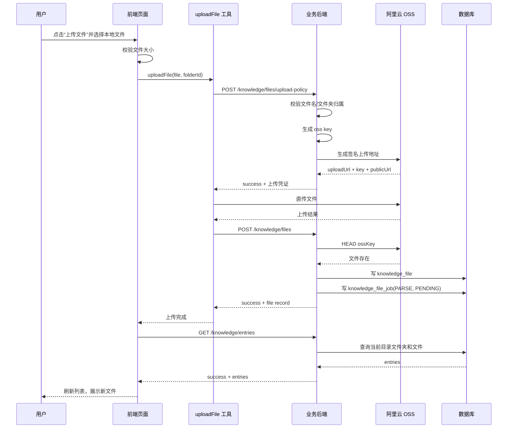

# 知识库上传流程说明

更新时间：2026-05-20  
适用项目：`k12-agent-frontend`、`k12-agent-backend`

## 1. 目标

本文档梳理当前“知识库上传”的完整链路，覆盖：

- 前端上传入口
- 上传时序图
- 前后端接口表
- 关键数据字段
- 当前实现中的对齐问题

本文只描述“文件上传并登记到知识库”的流程。文档解析、切片、向量化、检索入库等后续处理，当前代码里仅看到任务落库，未看到任务消费端。

## 2. 入口页面

当前有两个前端上传入口：

1. 根目录知识库页面  
   文件：[k12-agent-frontend/src/views/workspace/KnowledgeBase.vue](../../k12-agent-frontend/src/views/workspace/KnowledgeBase.vue)

2. 文件夹详情页面  
   文件：[k12-agent-frontend/src/views/workspace/KnowledgeBaseFolder.vue](../../k12-agent-frontend/src/views/workspace/KnowledgeBaseFolder.vue)

两处页面最终都调用同一个上传工具函数：

- [k12-agent-frontend/src/utils/knowledge.ts](../../k12-agent-frontend/src/utils/knowledge.ts)
- 方法：`uploadFile(file, folderId)`

## 3. 当前上传时序图



## 4. 页面侧流程

### 4.1 根目录上传

文件：[k12-agent-frontend/src/views/workspace/KnowledgeBase.vue](../../k12-agent-frontend/src/views/workspace/KnowledgeBase.vue)

- `triggerFileUpload()`：触发隐藏文件选择框
- `handleFileSelect(event)`：
  - 读取 `event.target.files`
  - 调 `validateFileSizes(files)` 做大小校验
  - 对每个有效文件依次执行 `await uploadFile(file, null)`
  - 完成后调 `fetchData()` 刷新根目录内容和存储统计

特点：

- 上传目标固定为根目录，所以 `folderId = null`
- 当前是串行上传，多文件会一个一个传

### 4.2 文件夹内上传

文件：[k12-agent-frontend/src/views/workspace/KnowledgeBaseFolder.vue](../../k12-agent-frontend/src/views/workspace/KnowledgeBaseFolder.vue)

- `triggerFileUpload()`：触发隐藏文件选择框
- `handleFileSelect(e)`：
  - 读取 `e.target.files`
  - 调 `validateFileSizes(files)` 做大小校验
  - 通过路由参数取当前文件夹 `route.params.folderId`
  - 对每个有效文件依次执行 `await uploadFile(file, targetFolderId)`
  - 完成后调 `fetchFolderData()` 刷新当前文件夹内容

特点：

- 上传目标是当前文件夹，所以 `folderId = route.params.folderId`
- 同样是串行上传

## 5. 前端上传工具函数

文件：[k12-agent-frontend/src/utils/knowledge.ts](../../k12-agent-frontend/src/utils/knowledge.ts)

`uploadFile(file, folderId)` 的设计意图是三段式：

1. 向后端申请上传凭证
2. 把文件直传到 OSS
3. 回调后端创建知识库文件记录

当前代码中的主要步骤：

### 5.1 本地校验

- 文件大小限制由 `validateFileSizes(files)` 完成
- 限制值来自 `MAX_FILE_SIZE`

### 5.2 申请上传凭证

调用：

- `knowledgeApi.getUploadPolicy(policyData)`
- 对应接口：`POST /knowledge/files/upload-policy`

当前前端发送字段：

```json
{
  "fileName": "example.pdf",
  "fileSize": 123456
}
```

### 5.3 上传到 OSS

当前前端逻辑是：

```js
const formData = new FormData()
formData.append('file', file)

await fetch(uploadUrl, {
  method: 'POST',
  body: formData
})
```

### 5.4 创建业务文件记录

调用：

- `knowledgeApi.createFile(fileData)`
- 对应接口：`POST /knowledge/files`

当前前端发送字段：

```json
{
  "name": "example.pdf",
  "ossKey": "......",
  "size": 123456,
  "folderId": 12
}
```

成功后页面会重新请求：

- `GET /knowledge/entries`

用于刷新当前目录的文件夹和文件列表。

## 6. 后端接口表

### 6.1 获取当前目录内容

| 接口 | 方法 | 作用 | 主要参数 | 返回 |
| --- | --- | --- | --- | --- |
| `/knowledge/entries` | GET | 查询当前目录下的文件夹和文件 | `parentId?`、`keyword?` | `{ parentId, folders, files }` |

说明：

- 根目录时 `parentId` 为空
- 子目录时 `parentId` 为当前文件夹 ID

### 6.2 申请上传凭证

| 接口 | 方法 | 作用 | 主要参数 | 返回 |
| --- | --- | --- | --- | --- |
| `/knowledge/files/upload-policy` | POST | 生成 OSS 直传地址 | `fileName`、`contentType?`、`folderId?` | `key`、`uploadUrl`、`publicUrl`、`expiresInSeconds` |

控制器文件：

- [src/knowledge/knowledge.controller.ts](../src/knowledge/knowledge.controller.ts)

服务文件：

- [src/knowledge/knowledge.service.ts](../src/knowledge/knowledge.service.ts)

后端处理逻辑：

1. 校验文件名非空、长度不超过 255
2. 如果指定了 `folderId`，校验该文件夹属于当前登录用户
3. 生成 OSS 对象路径
4. 返回阿里云 OSS 签名上传地址

### 6.3 创建知识库文件记录

| 接口 | 方法 | 作用 | 主要参数 | 返回 |
| --- | --- | --- | --- | --- |
| `/knowledge/files` | POST | 在业务库登记已上传文件 | `name`、`ossKey`、`size?`、`mimeType?`、`folderId?`、`url?` | 新建的 `knowledgeFile` 记录 |

后端处理逻辑：

1. 校验文件名
2. 校验 `folderId` 是否属于当前用户
3. 校验 `ossKey` 必填
4. 调 `ossService.head(ossKey)` 确认 OSS 上对象已存在
5. 创建 `knowledgeFile` 记录
6. 创建一条 `knowledgeFileJob` 记录

创建出的默认状态：

- `status = UPLOADED`
- `parseStatus = PENDING`

同时还会写入一条解析任务：

- `jobType = PARSE`
- `status = PENDING`

### 6.4 删除文件

| 接口 | 方法 | 作用 | 主要参数 | 返回 |
| --- | --- | --- | --- | --- |
| `/knowledge/files/:id` | DELETE | 软删除文件并尝试删除 OSS 对象 | `id` | `{ success: true }` |

### 6.5 查询存储统计

| 接口 | 方法 | 作用 | 主要参数 | 返回 |
| --- | --- | --- | --- | --- |
| `/knowledge/storage/stats` | GET | 查询知识库容量统计 | 无 | `folderCount`、`fileCount`、`usedBytes`、`totalBytes`、`usageRate` |

## 7. 关键数据字段

### 7.1 `folderId`

- `null`：表示根目录
- 数值：表示上传到某个具体文件夹

### 7.2 `ossKey`

这是后端生成的 OSS 对象路径，不是前端自己拼出来的。

生成规则在 `buildObjectKey()` 中，格式类似：

```text
knowledge/{userId}/{year}/{month}/{uuid}-{safeFileName}
```

示例：

```text
knowledge/25/2026/05/550e8400-e29b-41d4-a716-446655440000-lesson-plan.pdf
```

### 7.3 `url`

如果前端没有显式传 `url`，后端会自动用 `ossService.getPublicUrl(ossKey)` 生成公开访问地址。

### 7.4 文件状态

当前能看到的两层状态：

- 文件记录状态：`status`
- 解析状态：`parseStatus`

上传落库时默认值为：

- `status = UPLOADED`
- `parseStatus = PENDING`

## 8. 鉴权与权限控制

知识库接口都挂在 `KnowledgeController` 下，并使用：

- `@UseGuards(JwtAuthGuard)`

前端请求通过 `request()` 方法自动携带：

- `Authorization: Bearer <token>`

后端会按当前登录用户做资源隔离：

- 文件夹查询只查 `ownerId = user.id`
- 文件查询只查 `ownerId = user.id`
- 上传到子目录前会校验文件夹归属
- 文件删除、批量移动、批量删除也都会校验资源归属

## 9. 当前实现中的对齐问题

这部分非常关键。当前“流程设计”已经具备，但“前后端协议”没有完全对齐。

### 9.1 上传凭证返回字段名不一致

前端在 `uploadFile()` 中读取：

```js
const { uploadUrl, fileKey } = policyRes.data
```

但后端实际返回的是：

```json
{
  "key": "knowledge/...",
  "uploadUrl": "...",
  "publicUrl": "...",
  "expiresInSeconds": 600
}
```

影响：

- 前端后续创建文件记录时可能拿不到正确的 `ossKey`

### 9.2 OSS 上传方法不一致

前端当前实现：

- `POST`
- `FormData`

后端签名 URL 当前实现：

- `PUT`
- 适合直接上传文件二进制

影响：

- 即使拿到签名 URL，前端也可能无法按当前方式成功上传到 OSS

### 9.3 申请上传凭证的请求字段不一致

前端当前传：

```json
{
  "fileName": "example.pdf",
  "fileSize": 123456
}
```

后端当前接收定义：

```json
{
  "fileName": "example.pdf",
  "contentType": "application/pdf",
  "folderId": 12
}
```

说明：

- `fileSize` 目前后端没有使用
- `contentType` 和 `folderId` 才是更匹配当前后端实现的字段

### 9.4 解析任务仅落库，未见执行链路

后端在创建文件记录时会插入 `knowledgeFileJob`：

- `jobType = PARSE`
- `status = PENDING`

但在当前代码里，未看到：

- 任务调度器
- 消费 worker
- 文档解析器
- 向量化入库流程

这意味着当前代码更准确地说是：

- “上传到 OSS + 写知识库文件记录 + 写一条待解析任务”

而不是完整的：

- “上传后即可被知识库检索使用”

## 10. 推荐的标准化链路

如果按当前后端实现收敛，推荐前端统一为下面这套协议：

### 10.1 申请上传凭证

请求：

```json
{
  "fileName": "example.pdf",
  "contentType": "application/pdf",
  "folderId": 12
}
```

响应：

```json
{
  "success": true,
  "data": {
    "key": "knowledge/25/2026/05/uuid-example.pdf",
    "uploadUrl": "https://...",
    "publicUrl": "https://...",
    "expiresInSeconds": 600
  }
}
```

### 10.2 直传 OSS

建议方式：

```js
await fetch(uploadUrl, {
  method: 'PUT',
  body: file,
  headers: {
    'Content-Type': file.type || 'application/octet-stream'
  }
})
```

### 10.3 回写文件记录

请求：

```json
{
  "name": "example.pdf",
  "mimeType": "application/pdf",
  "size": 123456,
  "ossKey": "knowledge/25/2026/05/uuid-example.pdf",
  "folderId": 12,
  "url": "https://..."
}
```

## 11. 代码定位索引

### 前端

- 页面入口：
  - [k12-agent-frontend/src/views/workspace/KnowledgeBase.vue](../../k12-agent-frontend/src/views/workspace/KnowledgeBase.vue)
  - [k12-agent-frontend/src/views/workspace/KnowledgeBaseFolder.vue](../../k12-agent-frontend/src/views/workspace/KnowledgeBaseFolder.vue)
- 上传工具：
  - [k12-agent-frontend/src/utils/knowledge.ts](../../k12-agent-frontend/src/utils/knowledge.ts)
- API 定义：
  - [k12-agent-frontend/src/api/api.js](../../k12-agent-frontend/src/api/api.js)

### 后端

- 控制器：
  - [src/knowledge/knowledge.controller.ts](../src/knowledge/knowledge.controller.ts)
- 服务：
  - [src/knowledge/knowledge.service.ts](../src/knowledge/knowledge.service.ts)
- OSS：
  - [src/oss/oss.service.ts](../src/oss/oss.service.ts)

## 12. 一句话总结

当前知识库上传已经采用“业务后端签发凭证 -> 前端直传 OSS -> 业务后端登记文件 -> 写入解析任务”的标准两段式上传结构，但前端上传实现仍与后端签名协议存在差异，需要统一字段名和上传方法后，这条链路才能稳定联调通过。
